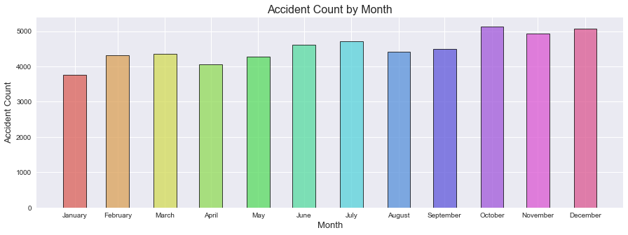
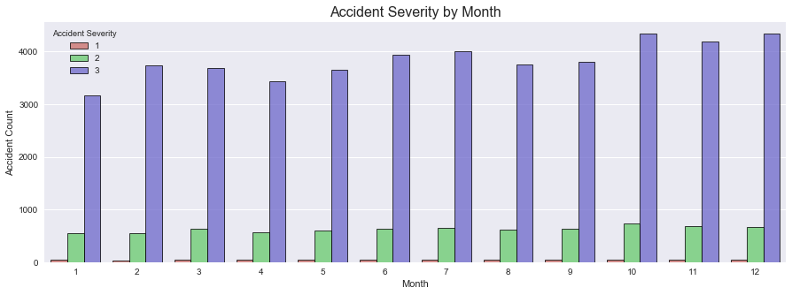

```
# ----------------------------------------------------------------------
# **Part 1: File Set Up**
# ----------------------------------------------------------------------

#===========DEPENDENCIES=============
import matplotlib.pyplot as plt
import pandas as pd
import numpy as np
import os
import seaborn as sns
import requests

pd.set_option('display.max_columns', None)
```


```
#============IMPORT==============
csv_file_path = os.path.join('Resources', 'accidents_2014.csv')
traffic_df = pd.read_csv(csv_file_path)
```


```
#============DROP BLANK COLUMNS===========

traffic_df.dropna(
    axis=1,
    how='all',
    inplace=True
)

#============DROP BLANK ROWS WITH BLANK VALUES==========

traffic_df['Junction_Control'].replace(
    np.nan, 'None', inplace=True)

traffic_df.replace(
    '', np.nan, inplace=True)

traffic_df.replace(
    'Unknown', np.nan, inplace=True)

traffic_df.dropna(axis=0, inplace=True)

#===========REPLACING ERRANT/MISPELLED VALUES===============

traffic_df['Light_Conditions'].replace(
    'Darkeness: No street lighting',
    'Darkness: No street lighting', 
    inplace=True
)

traffic_df['Pedestrian_Crossing-Physical_Facilities'].replace(
    'non-junction pedestrian crossing',
    'Non-junction Pedestrian Crossing', 
    inplace=True
)

#===========RENAMING COLUMNS===============

traffic_df.rename(columns=
    {'Accident_Index' : 'Accident Index',
     'Longitude' : 'Longitude', 
     'Latitude' : 'Latitude', 
     'Police_Force' : 'Police Force', 
     'Accident_Severity' : 'Accident Severity', 
     'Number_of_Vehicles' : 'Number of Vehicles', 
     'Number_of_Casualties' : 'Number of Casualties', 
     'Date' : 'Date', 
     'Day_of_Week' : 'Day of Week', 
     'Time' : 'Time', 
     'Local_Authority_(District)' : 'Local Authority District', 
     'Local_Authority_(Highway)' : 'Local Authority Highway', 
     '1st_Road_Class' : '1st Road Class', 
     '1st_Road_Number' : '1st Road Number', 
     'Road_Type' : 'Road Type', 
     'Speed_limit' : 'Speed Limit', 
     'Junction_Control' : 'Junction Control', 
     '2nd_Road_Class' : '2nd Road Class', 
     '2nd_Road_Number' : '2nd Road Number', 
     'Pedestrian_Crossing-Human_Control' : 'Pedestrian Crossing Human Control', 
     'Pedestrian_Crossing-Physical_Facilities' : 'Pedestrian Crossing Physical Facilities', 
     'Light_Conditions' : 'Light Conditions', 
     'Weather_Conditions' : 'Weather Conditions', 
     'Road_Surface_Conditions' : 'Road Surface Conditions', 
     'Special_Conditions_at_Site' : 'Special Conditions at Site', 
     'Carriageway_Hazards' : 'Carriageway Hazards', 
     'Urban_or_Rural_Area' : 'Urban or Rural Area', 
     'Did_Police_Officer_Attend_Scene_of_Accident' : 'Police Attended Scene of Accident', 
     'LSOA_of_Accident_Location' : 'LSOA of Accident Location', 
     'Year' : 'Year', 
    }, inplace=True)

# format Date in Datetime format
traffic_df['Date'] = pd.to_datetime(traffic_df['Date'], format='%d/%m/%y')

# display cleaned file
traffic_df.head()
```


<div>
<style scoped>
    .dataframe tbody tr th:only-of-type {
        vertical-align: middle;
    }

    .dataframe tbody tr th {
        vertical-align: top;
    }

    .dataframe thead th {
        text-align: right;
    }
</style>
<table border="1" class="dataframe">
  <thead>
    <tr style="text-align: right;">
      <th></th>
      <th>Accident Index</th>
      <th>Longitude</th>
      <th>Latitude</th>
      <th>Police Force</th>
      <th>Accident Severity</th>
      <th>Number of Vehicles</th>
      <th>Number of Casualties</th>
      <th>Date</th>
      <th>Day of Week</th>
      <th>Time</th>
      <th>Local Authority District</th>
      <th>Local Authority Highway</th>
      <th>1st Road Class</th>
      <th>1st Road Number</th>
      <th>Road Type</th>
      <th>Speed Limit</th>
      <th>Junction Control</th>
      <th>2nd Road Class</th>
      <th>2nd Road Number</th>
      <th>Pedestrian Crossing Human Control</th>
      <th>Pedestrian Crossing Physical Facilities</th>
      <th>Light Conditions</th>
      <th>Weather Conditions</th>
      <th>Road Surface Conditions</th>
      <th>Special Conditions at Site</th>
      <th>Carriageway Hazards</th>
      <th>Urban or Rural Area</th>
      <th>Police Attended Scene of Accident</th>
      <th>LSOA of Accident Location</th>
      <th>Year</th>
    </tr>
  </thead>
  <tbody>
    <tr>
      <th>0</th>
      <td>201401BS70001</td>
      <td>-0.206443</td>
      <td>51.496345</td>
      <td>1</td>
      <td>3</td>
      <td>2</td>
      <td>1</td>
      <td>2014-01-09</td>
      <td>5</td>
      <td>13:21</td>
      <td>12</td>
      <td>E09000020</td>
      <td>3</td>
      <td>315</td>
      <td>Single carriageway</td>
      <td>30</td>
      <td>None</td>
      <td>-1</td>
      <td>0</td>
      <td>None within 50 metres</td>
      <td>No physical crossing within 50 meters</td>
      <td>Daylight: Street light present</td>
      <td>Raining without high winds</td>
      <td>Wet/Damp</td>
      <td>None</td>
      <td>None</td>
      <td>1</td>
      <td>No</td>
      <td>E01002814</td>
      <td>2014</td>
    </tr>
    <tr>
      <th>1</th>
      <td>201401BS70006</td>
      <td>-0.171308</td>
      <td>51.495892</td>
      <td>1</td>
      <td>3</td>
      <td>2</td>
      <td>1</td>
      <td>2014-01-09</td>
      <td>5</td>
      <td>8:50</td>
      <td>12</td>
      <td>E09000020</td>
      <td>3</td>
      <td>4</td>
      <td>Single carriageway</td>
      <td>30</td>
      <td>Giveway or uncontrolled</td>
      <td>3</td>
      <td>4</td>
      <td>None within 50 metres</td>
      <td>Central refuge</td>
      <td>Daylight: Street light present</td>
      <td>Fine without high winds</td>
      <td>Dry</td>
      <td>None</td>
      <td>None</td>
      <td>1</td>
      <td>Yes</td>
      <td>E01002821</td>
      <td>2014</td>
    </tr>
    <tr>
      <th>2</th>
      <td>201401BS70009</td>
      <td>-0.201326</td>
      <td>51.498245</td>
      <td>1</td>
      <td>3</td>
      <td>2</td>
      <td>1</td>
      <td>2014-01-10</td>
      <td>6</td>
      <td>18:25</td>
      <td>12</td>
      <td>E09000020</td>
      <td>3</td>
      <td>315</td>
      <td>Single carriageway</td>
      <td>30</td>
      <td>Giveway or uncontrolled</td>
      <td>6</td>
      <td>0</td>
      <td>None within 50 metres</td>
      <td>No physical crossing within 50 meters</td>
      <td>Darkness: Street lights present and lit</td>
      <td>Fine without high winds</td>
      <td>Wet/Damp</td>
      <td>None</td>
      <td>None</td>
      <td>1</td>
      <td>Yes</td>
      <td>E01002817</td>
      <td>2014</td>
    </tr>
    <tr>
      <th>3</th>
      <td>201401BS70011</td>
      <td>-0.207445</td>
      <td>51.507511</td>
      <td>1</td>
      <td>3</td>
      <td>2</td>
      <td>1</td>
      <td>2014-01-10</td>
      <td>6</td>
      <td>10:55</td>
      <td>12</td>
      <td>E09000020</td>
      <td>5</td>
      <td>0</td>
      <td>Single carriageway</td>
      <td>30</td>
      <td>Giveway or uncontrolled</td>
      <td>6</td>
      <td>0</td>
      <td>None within 50 metres</td>
      <td>No physical crossing within 50 meters</td>
      <td>Daylight: Street light present</td>
      <td>Fine without high winds</td>
      <td>Dry</td>
      <td>None</td>
      <td>None</td>
      <td>1</td>
      <td>Yes</td>
      <td>E01002871</td>
      <td>2014</td>
    </tr>
    <tr>
      <th>4</th>
      <td>201401BS70013</td>
      <td>-0.179731</td>
      <td>51.497822</td>
      <td>1</td>
      <td>3</td>
      <td>2</td>
      <td>1</td>
      <td>2014-01-05</td>
      <td>1</td>
      <td>20:26</td>
      <td>12</td>
      <td>E09000020</td>
      <td>5</td>
      <td>0</td>
      <td>Single carriageway</td>
      <td>30</td>
      <td>Giveway or uncontrolled</td>
      <td>5</td>
      <td>0</td>
      <td>None within 50 metres</td>
      <td>No physical crossing within 50 meters</td>
      <td>Darkness: Street lights present and lit</td>
      <td>Raining without high winds</td>
      <td>Wet/Damp</td>
      <td>None</td>
      <td>None</td>
      <td>1</td>
      <td>Yes</td>
      <td>E01002892</td>
      <td>2014</td>
    </tr>
  </tbody>
</table>
</div>


```
# ----------------------------------------------------------------------
# **Part 2: Set up overall formatting**
# ----------------------------------------------------------------------
# create color palette with 12 colors (for use with monthly data)
twelveColorPalette = sns.color_palette('hls', 12)
twelve = sns.palplot(twelveColorPalette)

# create color palette with 8 colors (for use with weather conditions)
eightColorPalette = sns.color_palette('hls', 8)
eight = sns.palplot(eightColorPalette)

# create color palette with 5 colors (for use with road/light conditions)
fiveColorPalette = sns.color_palette('hls', 5)
five = sns.palplot(fiveColorPalette)

# create color palette with 3 colors (for data by severity)
threeColorPalette = sns.color_palette('hls', 3)
three = sns.palplot(threeColorPalette)

# display color palettes
three
five
eight
twelve
```


# Basic Data Visualizations


```
# ----------------------------------------------------------------------
# **Part 2: Basic Data Visualizations**
# This section contains basic data visualizations for the overall 
# dataset without deep analytical goals. 
# ----------------------------------------------------------------------

# ----------------------------------------------------------------------
# Part 2.1: Geographical heatmap
# ----------------------------------------------------------------------

```

## Count of Traffic Accidents by Month


```
# ----------------------------------------------------------------------
# Part 2.2: Count of Traffic Accidents by Month
# ----------------------------------------------------------------------

# set up list of months
month_list = ['January', 'February', 'March', 'April', 'May', 'June', 
              'July', 'August', 'September', 'October', 'November', 
              'December']

# set up data
trafficDataByMonth_df = traffic_df
trafficDataByMonth_df.index = trafficDataByMonth_df['Date']
trafficDataByMonth_df = pd.DataFrame(trafficDataByMonth_df.resample('M').count()['Accident Index'])
trafficDataByMonth_df = trafficDataByMonth_df.reset_index()[['Date', 
                                                             'Accident Index']]
trafficDataByMonth_df.rename(columns={'Accident Index':'Accident Count'}, 
                             inplace=True )

# set up tick locations
x_axis = trafficDataByMonth_df['Date']
y_axis = trafficDataByMonth_df['Accident Count']

# create bar plot
sns.set()
plt.rcParams["figure.figsize"] = [15,5]
plt.bar(trafficDataByMonth_df['Date'], 
        trafficDataByMonth_df['Accident Count'], 
        color=twelveColorPalette, width=15, align='center', linewidth=1, 
        edgecolor='black', tick_label=month_list, alpha=0.75)
plt.title("Accident Count by Month", size=16)
plt.xlabel("Month", size=13)
plt.ylabel("Accident Count", size=13)
plt.show()
```





```
# ----------------------------------------------------------------------
# Part 2.3: Grouped Bar chart of severity by month
# ----------------------------------------------------------------------

# create dataframe holding all data
accSevByMonth_df = traffic_df
accSevByMonth_df.index = accSevByMonth_df['Date']
accSevByMonth_df['Month'] = accSevByMonth_df.index.month
accSevByMonth_df = pd.DataFrame(accSevByMonth_df.\
                                groupby(['Month', 'Accident Severity']).\
                                count()['Accident Index'])
accSevByMonth_df.reset_index(inplace=True)
accSevByMonth_df[['Month', 
                  'Accident Severity', 
                  'Accident Index']]
accSevByMonth_df.rename(columns={'Accident Index':'Accident Count'}, 
                        inplace=True)

# create bar plot
accidentSeverityByMonth_plt = sns.barplot(x='Month', y='Accident Count', 
                                          data=accSevByMonth_df, 
                                          hue='Accident Severity', 
                                          palette=threeColorPalette, 
                                          edgecolor='black', alpha=0.75, 
                                          linewidth=1)
plt.title("Accident Severity by Month", size=16)
plt.show(accidentSeverityByMonth_plt)
```





```
# create base dataframe to work with
accSevByMonth2_df = traffic_df
accSevByMonth2_df.index = accSevByMonth2_df['Date']
accSevByMonth2_df['Month'] = accSevByMonth2_df.index.month

# create three separate dataframes by severity
levelOneByMonth_df = pd.DataFrame(accSevByMonth2_df[accSevByMonth2_df['Accident Severity']==1].\
                                  groupby('Month').count()['Accident Index']).reset_index()
levelTwoByMonth_df = pd.DataFrame(accSevByMonth2_df[accSevByMonth2_df['Accident Severity']==2].\
                                  groupby('Month').count()['Accident Index']).reset_index()
levelThreeByMonth_df = pd.DataFrame(accSevByMonth2_df[accSevByMonth2_df['Accident Severity']==3].\
                                    groupby('Month').count()['Accident Index']).reset_index()

# create stacked bar plot
plt.rcParams["figure.figsize"] = [16,8]
plt.bar(levelThreeByMonth_df['Month'], 
        levelThreeByMonth_df['Accident Index'], 
        color='#5D56D3', width=0.75, align='center', linewidth=1, 
        edgecolor='black', tick_label=month_list, alpha=0.75)
plt.bar(levelTwoByMonth_df['Month'], 
        levelTwoByMonth_df['Accident Index'], 
        bottom=levelThreeByMonth_df['Accident Index'],
        color='#7CD96E', width=0.75, align='center', linewidth=1, 
        edgecolor='black', tick_label=month_list, alpha=0.75)
plt.bar(levelOneByMonth_df['Month'], 
        levelOneByMonth_df['Accident Index'], 
        bottom=[i+j for i,j in zip(levelThreeByMonth_df['Accident Index'], 
                                   levelTwoByMonth_df['Accident Index'])],
        color='#CC655B', width=0.75, align='center', linewidth=1, 
        edgecolor='black', tick_label=month_list, alpha=0.75)

# format bar plot
plt.title("Accident Severity by Month", size=16)
plt.xlabel("Month", size=13)
plt.ylabel("Accident Count", size=13)

# add legend
import matplotlib.patches as mpatches
sev1 = mpatches.Patch(color='#CC655B', label='1', alpha=0.75)
sev2 = mpatches.Patch(color='#7CD96E', label='2', alpha=0.75)
sev3 = mpatches.Patch(color='#5D56D3', label='3', alpha=0.75)
plt.legend(handles=[sev1, sev2, sev3], 
           loc='best', title='Accident Severity')
plt.show()
```


